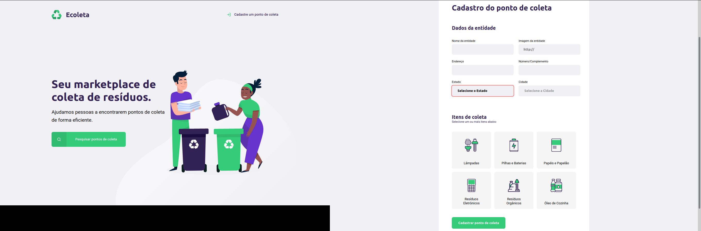

## Ecoleta, é um projeto que está sendo desenvolvido durante o evento NLW (Next Level Week) e distribuida pela [Rocketseat](https://rocketseat.com.br/):rocket:

### Objetivo:
O principal objetivo deste projeto é criar um **marketplace** onde as pessoas possam encontrar pontos de coleta de lixo de modo eficiente.
 

